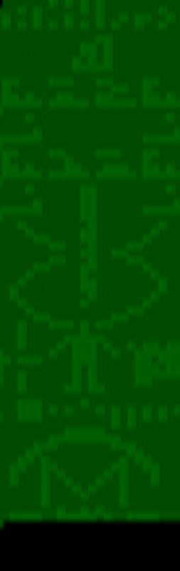

# Arecibo-Message-1974
Python encoder and decoder for the Arecibo SETI message sent in 1974

Image can be listened in WAV format or saved as an image.

The message was broadcast into space via frequency modulated radio waves at a ceremony to mark the remodeling of the Arecibo radio telescope in Puerto Rico on 16 November 1974. The message was aimed at the current location of M13, about 25,000 light years from Earth, because M13 was a large and relatively close collection of stars that was available in the sky at the time and place of the ceremony. When correctly translated into graphics, characters, and spaces, the 1,679 bits of data contained within the message form the image shown here.

